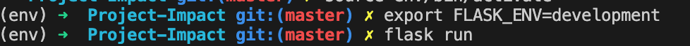

# PROJECT IMPACT 

---
---


## See Full Documentation 
[Full Documentation](https://robotgyal.github.io/Project-Impact/#/)

---


## Pitch Slide Deck
[Slides](https://www.canva.com/design/DAD0w0GqH7c/QKkt-L1AGj_NY054WHK1aQ/view?utm_content=DAD0w0GqH7c&utm_campaign=designshare&utm_medium=link&utm_source=sharebutton)

---


## Motivation

I decided to do this project to raise awareness about different space rocks and how they can affect our daily lives.
For example, as someone with no desire to live in a area with high meteor landing activity, I would love to have a tool that can tell me where those areas are.

---


## Technologies
This project was built with:
* [Python](https://www.python.org/)
* [Flask]()
* [Heroku]()
* [Jupyter Notebook]()
* [SandDance]()


---


# How To Use

1. __Through Flask__
    + Clone repo to local device git clone https://github.com/RobotGyal/Eventuu.git
    + Install dependencies 'pip3 install -r requirements.txt'
    + In command line run `flask run'
        

2. __Live Link__
    * There is a live live available at [Project Impact](https://project-impact-ak.herokuapp.com/). It is hosted through [Heroku](www.heroku.com).

---


# Meteor Watchlist Routes

## '/'
```
GET
http://localhost:800/

```
Homepage

## '.../table'
```
GET
http://localhost:8000/table

```

Displays the raw data (sample size = 2000) of the original dataset

## '.../visuals'
```
GET
http://localhost:8000/visuals
```
Displays the current visualizations of the dataset sample


---


## Features
* Displays full dataset from NASA Meteorite dataset
* Visuals of sample from dataset

---


## Code Snippet
```

```

---


## Contributors 
* **Aleia Knight** - [Robotgyal](https://github.com/robotgyal)
*Gitmaster*


---


## Credit
[Meteorite Landings](https://data.nasa.gov/Space-Science/Meteorite-Landings/gh4g-9sfh)
